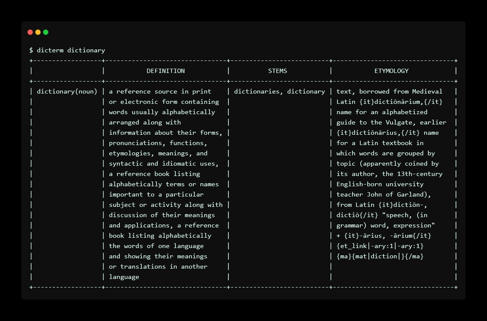

# dicterm


[](https://www.codacy.com/gh/murat/dicterm/dashboard?utm_source=github.com&utm_medium=referral&utm_content=murat/dicterm&utm_campaign=Badge_Grade)
[](https://www.codacy.com/gh/murat/dicterm/dashboard?utm_source=github.com&utm_medium=referral&utm_content=murat/dicterm&utm_campaign=Badge_Coverage)

dicterm is a cli interface for merriem webster dictionary. Uses [murat/mwgoapi](https://github.com/murat/mwgoapi)

## Requirements

Get your api key from <https://dictionaryapi.com/account/my-keys>

## Build

```shell
➜ make build
# OR
➜ make            # installs to $GOPATH/bin
# OR
➜ make arch=arm64 # temporarily sets the GOARCH variable before installing
```

## Usage

If it's the first run, you must pass the `-key XXX` argument.
It will be stored in the `~/.dicterm` file.
You can specify a custom path via `-config /path/of/file`.
But if you set a custom path, you will need to pass it by the `-config /path/of/file` argument all time.

If you did not set a custom config path, you will be able to run the
simpler command like `dicterm word` after the first command.

```shell
➜ ./bin/dicterm -h
Usage of ./bin/dicterm:
  -config string
        path of config file, default ~/.dicterm
  -key string
        dict api key (will be stored in ~/.dicterm)
  -word string
        word to look up
```

## Screenshot



## Todo

-   [x] store key in a dotfile
-   [x] use a beatiful tui
